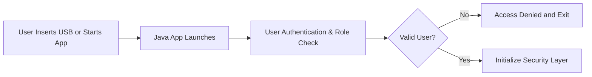
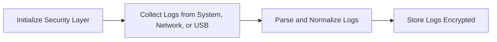
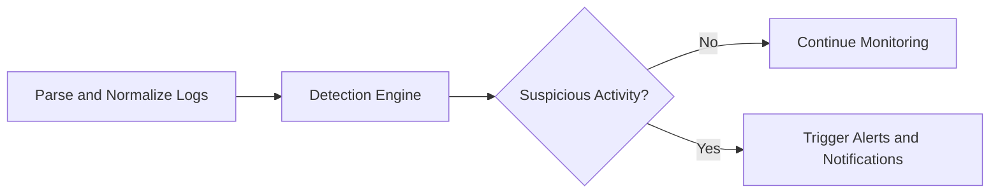
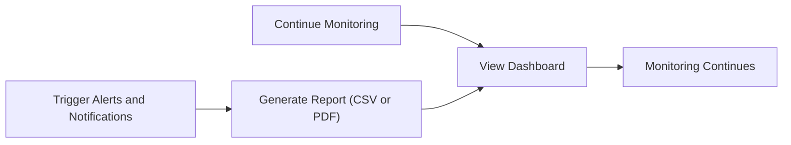

# 🔒 DarkEye

### *Portable Offline Log Analysis Tool for Air-Gapped Security*

[](https://github.com/your-username/DarkEye)
[](https://www.java.com/)

---

## 📌 Overview

**DarkEye** is a **cross-platform Java application** built for **air-gapped or isolated networks** where **data security is critical**.

It enables a lightweight, SOC-like capability offline:

* Collect system and network logs
* Parse & normalize logs into structured formats
* Detect suspicious activity via rules, heuristics, and anomaly detection
* Generate real-time popup alerts
* Store logs securely with AES encryption
* Maintain full offline functionality — **no cloud dependencies**

---

## ✨ Key Features

- **Cross-Platform Portability** – Windows, Linux, macOS  
- **Multi-source Log Collection** – System files, syslog, FTP, USB  
- **Parsing & Normalization** – Unified schema for heterogeneous logs  
- **Threat Detection**:
  - Rule/Signature-based (TTPs)
  - Heuristic analysis
  - Anomaly detection (spikes, unusual access)
- **Real-Time Alerts** – Desktop notifications for suspicious activity  
- **Secure Log Storage** – AES-256-GCM encrypted DB  
- **UI** – JavaFX dashboard for live monitoring, alerts, reports  
- **Offline Updates** – Import rules and threat feeds via USB/local files  
- **Reporting** – Export logs & reports in CSV or PDF  

---

## 🏗️ System Architecture

```

Collectors → Parsers → Normalizer → Encrypted Storage
                          ↘→ Detection Engine → Alerts (Popup/UI)

```

**Core Modules:**

- **Collectors:** SyslogCollector, FileCollector, USBCollector, FTPCollector  
- **Parsers:** SyslogParser, WindowsEventParser, ApacheLogParser  
- **Detection:** RuleEngine, AnomalyDetector  
- **Security:** Authentication, AES Encryption, Key Management  
- **UI:** JavaFX dashboard (login, live events, alerts, reports)  

---

## 🛡️ Security Highlights

- AES-256-GCM encrypted log storage  
- Password hashing (Argon2 / Bcrypt)  
- Role-based access control (Admin, Analyst, Viewer)  
- No network connections → fully air-gapped  

---

## 📂 Project Structure

```

log-analysis-tool/
├── src/main/java/com/sih/logtool/
│   ├── collectors/       # Log collectors
│   ├── parsers/          # Log parsers & normalizers
│   ├── detection/        # Rule engine & anomaly detection
│   ├── storage/          # Encrypted DB and repositories
│   ├── security/         # Auth & crypto services
│   ├── ui/               # JavaFX UI components
│   └── util/             # Config & utilities
├── resources/
│   ├── rules/            # Detection rules (JSON/YAML)
│   └── config/           # Config files
└── README.md

````

---

## 🚀 Getting Started

### Prerequisites

- Java 17+  
- Maven or Gradle  
- (Optional) Git  

### Installation

```bash
# Clone repository
git clone https://github.com/your-username/log-analysis-tool.git
cd log-analysis-tool

# Build project
mvn clean install
````

### Running the Application

```bash
java -jar target/log-analysis-tool.jar
```

---

## 📊 Example Use Case

1. Import system/firewall logs via USB.
2. Logs are normalized into structured format.
3. Detection engine flags suspicious IP activity.
4. **Popup alert** notifies analyst.
5. Logs remain **AES-encrypted** in the database.
6. Analyst exports a **security report** (CSV/PDF).

---

## ⚙️ Complete Project Workflow (Mermaid Diagrams)

### **Phase 1: System Initialization**



### **Phase 2: Log Collection & Parsing**



### **Phase 3: Threat Detection**



### **Phase 4: Reporting & Monitoring**



---

## 🤝 Contributing

Contributions welcome! Fork the repo and submit a pull request for review.

---

⚡ This tool provides **real-time situational awareness, secure log monitoring, and proactive threat detection** in offline environments, making it ideal for **air-gapped networks**.

## Done By Team The-Codex
A team of **innovators** and **up-minded** coding buddies.
