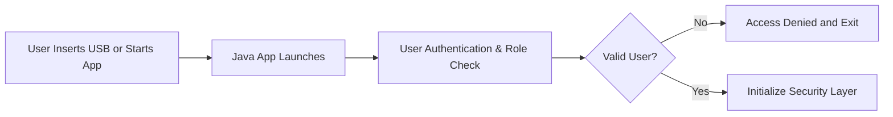
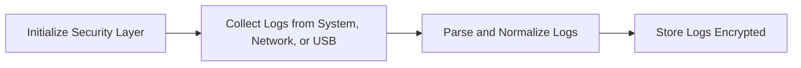
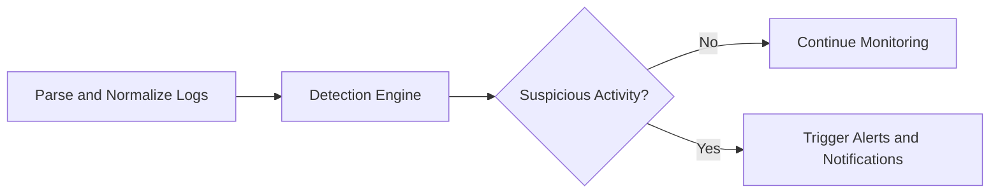
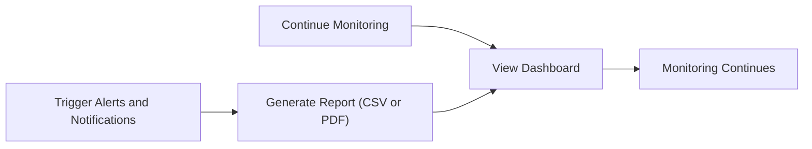

<<<<<<< HEAD
# DarkEye - Offline Log Analysis Desktop Application

DarkEye is a cross-platform Java desktop application for offline log analysis, designed for air-gapped environments where network connectivity is limited or prohibited.

## 🚀 Quick Start (Basic Version)

The basic version is now ready with core functionality:

### Features Implemented
- ✅ **JavaFX UI**: Modern desktop interface with log table and alerts
- ✅ **File Collector**: Reads log files from directories
- ✅ **Basic Detection**: Detects suspicious keywords, blacklisted IPs, and brute force attacks
- ✅ **Real-time Alerts**: Popup notifications for high-severity threats
- ✅ **Log Parsing**: Basic parsing of common log formats

### Running the Application

**⚠️ JavaFX Runtime Issue**: If you get "JavaFX runtime components are missing", see [SOLUTION.md](SOLUTION.md)

**Option 1 - Maven (Recommended)**:
1. **Prerequisites**: Java 17+ and Maven
2. **Build**: `mvn clean package`
3. **Run**: `java -jar target/darkeye-1.0.0-SNAPSHOT.jar`

**Option 2 - IDE (Easiest)**:
1. Open project in IntelliJ IDEA or Eclipse
2. Configure JavaFX SDK in project settings
3. Run directly from IDE

**Option 3 - Quick Test**:
- Use `run-darkeye.bat` (requires Maven)
- Use `run-jar.bat` (runs pre-built JAR)

### Testing with Sample Data

1. Run the application
2. Click "Browse" and select the `sample-logs` directory
3. Click "Start" to begin log collection
4. Watch for alerts in the alerts table and popup notifications

## 🔍 Detection Rules

The basic detection engine includes:

- **Blacklisted IPs**: Alerts when traffic comes from known malicious IPs
- **Suspicious Keywords**: Detects words like "attack", "breach", "malware"
- **Brute Force**: Identifies multiple failed login attempts from same IP
- **Unusual Activity**: Flags users with excessive log entries

## 🎯 Planned Features (Full Version)

- **Encrypted Storage**: AES-256-GCM encryption for all sensitive data
- **Advanced Parsing**: Apache, Syslog, Windows Event Logs
- **ML Detection**: Weka-based anomaly detection
- **Secure Authentication**: BCrypt password hashing with roles
- **Export Capabilities**: CSV and PDF report generation
- **Key Management**: PBKDF2-derived encryption keys

## 📁 Project Structure

```
src/main/java/com/darkeye/
├── ui/           # JavaFX interface
├── collectors/   # Log collection (FileCollector)
├── detection/    # Threat detection engine
├── model/        # LogEntry, Alert models
└── util/         # Utilities
```

## 🧪 Testing

Run tests with: `mvn test`

The basic functionality tests verify:
- File collection works
- Detection rules trigger correctly
- Models function properly

## 📝 Sample Logs

The `sample-logs/` directory contains example log files to test with:
- `access.log` - Apache access logs with suspicious activity
- `system.log` - System logs with various severity levels

## License

This project is licensed under the MIT License - see the LICENSE file for details.
=======
# 🔒 DarkEye

### *Portable Offline Log Analysis Tool for Air-Gapped Security*


[](https://github.com/your-username/DarkEye)
[](https://www.java.com/)

---

## 📌 Overview

**DarkEye** is a **cross-platform Java application** built for **air-gapped or isolated networks** where **data security is critical**.

It enables a lightweight, SOC-like capability offline:

* Collect system and network logs
* Parse & normalize logs into structured formats
* Detect suspicious activity via rules, heuristics, and anomaly detection
* Generate real-time popup alerts
* Store logs securely with AES encryption
* Maintain full offline functionality — **no cloud dependencies**

---

## ✨ Key Features

- **Cross-Platform Portability** – Windows, Linux, macOS  
- **Multi-source Log Collection** – System files, syslog, FTP, USB  
- **Parsing & Normalization** – Unified schema for heterogeneous logs  
- **Threat Detection**:
  - Rule/Signature-based (TTPs)
  - Heuristic analysis
  - Anomaly detection (spikes, unusual access)
- **Real-Time Alerts** – Desktop notifications for suspicious activity  
- **Secure Log Storage** – AES-256-GCM encrypted DB  
- **UI** – JavaFX dashboard for live monitoring, alerts, reports  
- **Offline Updates** – Import rules and threat feeds via USB/local files  
- **Reporting** – Export logs & reports in CSV or PDF  

---

## 🏗️ System Architecture

```

Collectors → Parsers → Normalizer → Encrypted Storage
                          ↘→ Detection Engine → Alerts (Popup/UI)

```

**Core Modules:**

- **Collectors:** SyslogCollector, FileCollector, USBCollector, FTPCollector  
- **Parsers:** SyslogParser, WindowsEventParser, ApacheLogParser  
- **Detection:** RuleEngine, AnomalyDetector  
- **Security:** Authentication, AES Encryption, Key Management  
- **UI:** JavaFX dashboard (login, live events, alerts, reports)  

---

## 🛡️ Security Highlights

- AES-256-GCM encrypted log storage  
- Password hashing (Argon2 / Bcrypt)  
- Role-based access control (Admin, Analyst, Viewer)  
- No network connections → fully air-gapped  

---

## 📂 Project Structure

```

log-analysis-tool/
├── src/main/java/com/sih/logtool/
│   ├── collectors/       # Log collectors
│   ├── parsers/          # Log parsers & normalizers
│   ├── detection/        # Rule engine & anomaly detection
│   ├── storage/          # Encrypted DB and repositories
│   ├── security/         # Auth & crypto services
│   ├── ui/               # JavaFX UI components
│   └── util/             # Config & utilities
├── resources/
│   ├── rules/            # Detection rules (JSON/YAML)
│   └── config/           # Config files
└── README.md

````

---

## 🚀 Getting Started

### Prerequisites

- Java 17+  
- Maven or Gradle  
- (Optional) Git  

### Installation

```bash
# Clone repository
git clone https://github.com/your-username/log-analysis-tool.git
cd log-analysis-tool

# Build project
mvn clean install
````

### Running the Application

```bash
java -jar target/log-analysis-tool.jar
```

---

## 📊 Example Use Case

1. Import system/firewall logs via USB.
2. Logs are normalized into structured format.
3. Detection engine flags suspicious IP activity.
4. **Popup alert** notifies analyst.
5. Logs remain **AES-encrypted** in the database.
6. Analyst exports a **security report** (CSV/PDF).

---

## ⚙️ Complete Project Workflow (Mermaid Diagrams)

### **Phase 1: System Initialization**



### **Phase 2: Log Collection & Parsing**



### **Phase 3: Threat Detection**



### **Phase 4: Reporting & Monitoring**



---

## 🤝 Contributing

Contributions welcome! Fork the repo and submit a pull request for review.

---

⚡ This tool provides **real-time situational awareness, secure log monitoring, and proactive threat detection** in offline environments, making it ideal for **air-gapped networks**.

## Done By Team The-Codex
A team of **innovators** and **up-minded** coding buddies.
>>>>>>> fba66c1df34c04f7acb845442c392ef4939e765e
